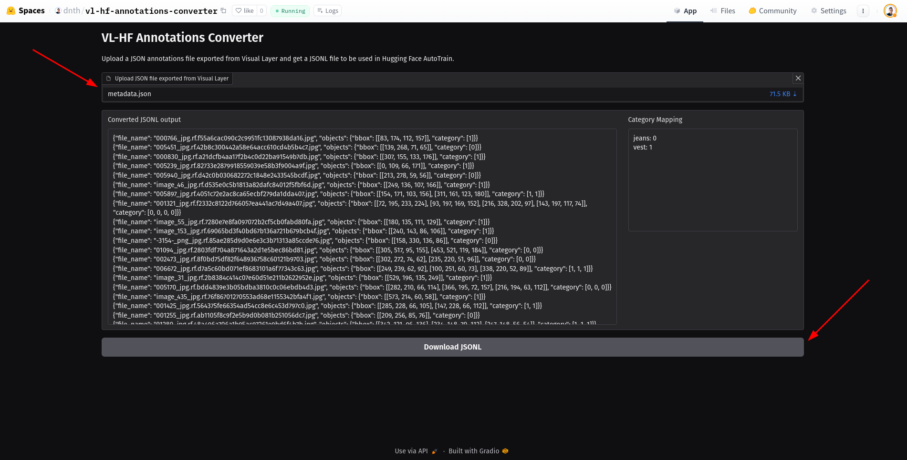
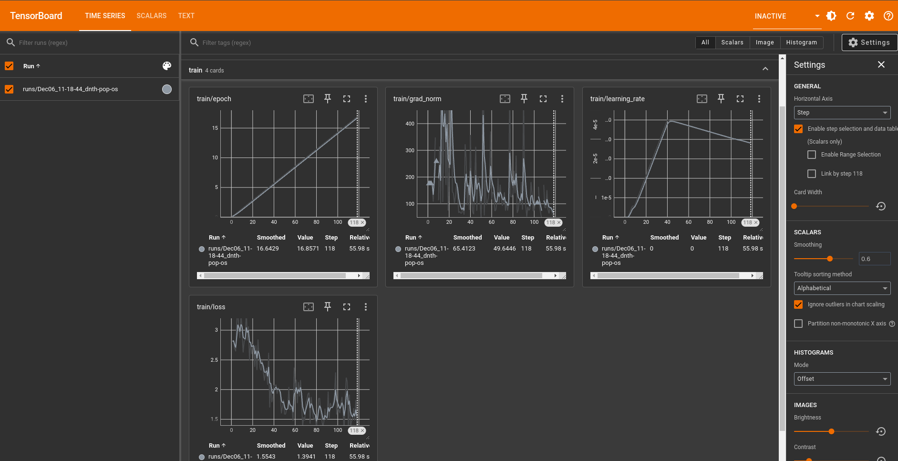

# VL to HF Annotation Converter

Convert bounding box annotations exported from the [Visual Layer](https://app.visual-layer.com/) format to the [Hugging Face](https://huggingface.co/) format and train a model with AutoTrain.


## Convert on Hugging Face Spaces

https://huggingface.co/spaces/dnth/vl-hf-annotations-converter



## Run the app locally

```bash
pip install -r requirements.txt
python app.py
```

## Train a model with AutoTrain
First, install the `autotrain-advanced` package:

```bash
pip install autotrain-advanced
```

Export your Hugging Face username and token:

```bash
export HF_USERNAME=your_hugging_face_username
export HF_TOKEN=your_hugging_face_write_token
```


Then, run the following command to start the training:

```bash
autotrain --config configs/detr-resnet-50.yml
```


See the progerss on tensorboard:

```bash
tensorboard --logdir="autotrain-detr-resnet-50"
```

You should see a screen like this on your browser (http://localhost:6006):

