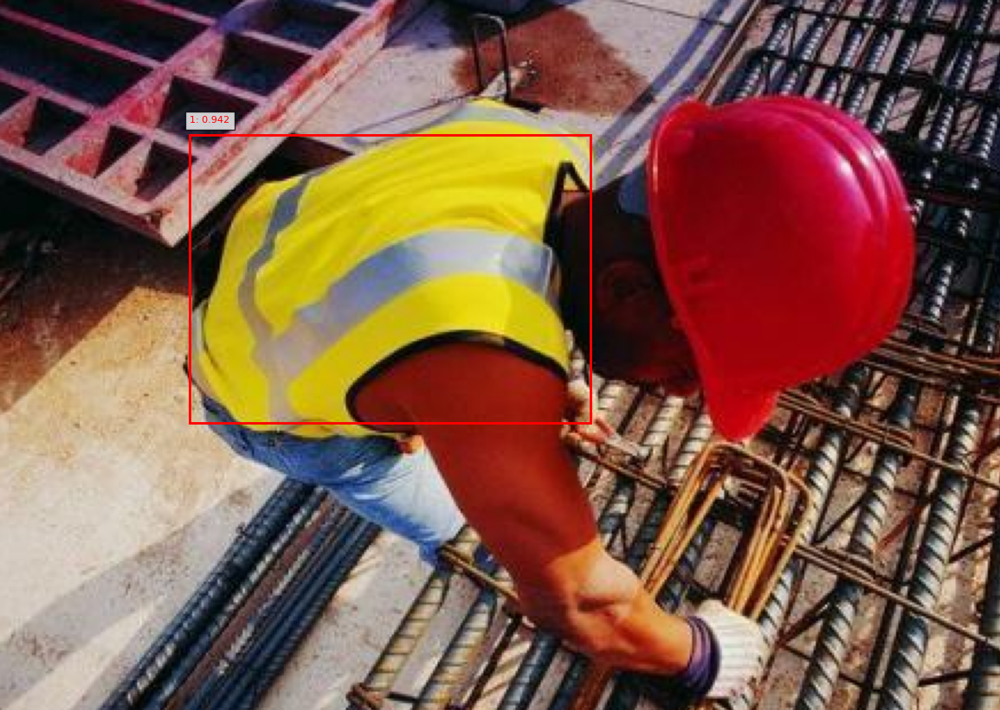

# VL to HF Annotation Converter

Convert bounding box annotations exported from the [Visual Layer](https://app.visual-layer.com/) format to the [Hugging Face](https://huggingface.co/) format and train a model with AutoTrain.

For a demo in this repo, I used a dataset from VL with 2 classes: `jeans` and `vest`.


And I exported the annotations in JSON format:


## Convert JSON annotations to JSONL
Once the export is done, you will have a zip file with the images and JSON annotations.
You can now convert the JSON annotations either on Hugging Face Spaces or locally. 

I recommend using the Hugging Face Spaces version because it's easier to use. Just upload the JSON file and you should get the JSONL file as a result.

### Hugging Face Spaces

https://huggingface.co/spaces/dnth/vl-hf-annotations-converter


Click on the Download JSONL button and and save it into the same folder as the JSON annotations.

>[!TIP] 
> Note the category mapping:
> - `0` - `jeans`
> - `1` - `vest`

### Local Conversion
If you prefer to convert the annotations locally, you can run the following command:

```bash
pip install -r requirements.txt
python app.py
```
The interface should be simliar to the one on Hugging Face Spaces.

## Train a model with AutoTrain
[colab_badge]: https://img.shields.io/badge/Open%20In-Colab-blue?style=for-the-badge&logo=google-colab
[kaggle_badge]: https://img.shields.io/badge/Open%20In-Kaggle-blue?style=for-the-badge&logo=kaggle

[![Open In Colab][colab_badge]](https://colab.research.google.com/github/dnth/vl-hf-annotation-converter/blob/main/nbs/quickstart.ipynb)
[![Open In Kaggle][kaggle_badge]](https://kaggle.com/kernels/welcome?src=https://github.com/dnth/vl-hf-annotation-converter/blob/main/nbs/quickstart.ipynb)

Now that you have the JSONL file, you can train a model with [AutoTrain](https://github.com/huggingface/autotrain-advanced). You can run all the following commands in Google Colab or Kaggle.

Install the `autotrain-advanced` package:

```bash
pip install autotrain-advanced
```

AutoTrain lets you train models with a simple command either on Hugging Face or locally.
If you'd like to train on Hugging Face, you can follow the instructions [here](https://huggingface.co/autotrain). You will need to create an account and pay for the GPU.

This demo proceeds with local training. 

Export your Hugging Face username and token:

```bash
export HF_USERNAME=your_hugging_face_username
export HF_TOKEN=your_hugging_face_write_token
```


Then, run the following command to start the training:

```bash
autotrain --config configs/detr-resnet-50.yml
```


See the training progress on Tensorboard:

```bash
tensorboard --logdir="autotrain-detr-resnet-50"
```

You should see a screen like this on your browser (http://localhost:6006):


If you don't have a GPU, you can use the free GPU on Kaggle or Colab and run the quick start notebook.

[![Open In Colab][colab_badge]](https://colab.research.google.com/github/dnth/vl-hf-annotation-converter/blob/main/nbs/quickstart.ipynb)
[![Open In Kaggle][kaggle_badge]](https://kaggle.com/kernels/welcome?src=https://github.com/dnth/vl-hf-annotation-converter/blob/main/nbs/quickstart.ipynb)


## Inference
Once training is done, you can run inference with the following command:

```bash
python inference.py
```



Verify the results with the category mapping:

- `0` - `jeans`
- `1` - `vest`


